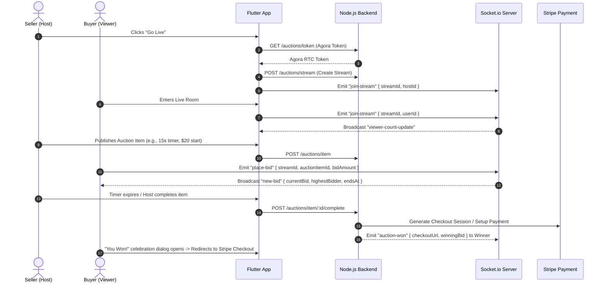
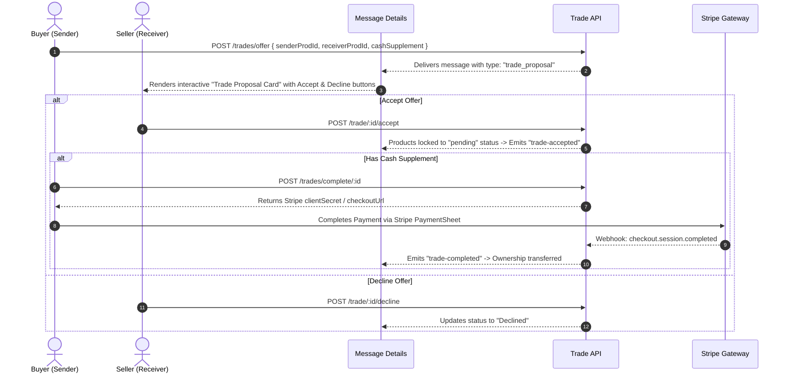

# 🃏 Culture Cards LLC — Live Stream Auction & Trading Marketplace

[](https://flutter.dev)
[](https://pub.dev/packages/get)
[](https://www.agora.io)
[](https://stripe.com)
[](https://firebase.google.com)

A high-performance, real-time live video streaming, auction bidding, and peer-to-peer collectible trading marketplace mobile application built with **Flutter**, **GetX**, **Agora RTC Engine**, **Socket.IO**, and **Stripe**.

---

## 🌟 Key Application Features

- 🎥 **Agora Live Video Broadcasting & Viewing:** Low-latency video streaming for hosts (sellers) and interactive viewing for audience with background service and Picture-in-Picture (PiP) support.
- ⚡ **Real-Time Live Bidding Engine:** Sub-second bidding powered by WebSockets (`Socket.IO`), short duration timers (5s, 10s, 15s, 30s, 60s), live viewer counters, and dynamic floating heart reactions.
- 🤝 **Direct Inbox Trade Proposals:** In-chat custom swap proposals with cash supplement options, direct Accept/Decline actions, and escrow status protection.
- 💳 **Stripe Payment Integration:** Instant checkout sessions and native Stripe PaymentSheets for auction wins and cash trade completions.
- 📦 **Shipping Weight & Auto PDF Label Viewer:** Item weight input (lbs, oz, kg), central office shipping verification, and built-in PDF shipping label viewer with print, download, and share capabilities.
- 👤 **Upcoming Shows Carousel & Trader Profiles:** Scheduled live stream showcases on seller profiles, trust scores, verified badges, and reviews.
- 🔐 **Intelligent Guest Mode (AuthGuard):** Browse-only mode for unregistered users with seamless bottom-sheet prompts when attempting restricted actions.
- 📸 **EXIF Auto-Orientation Engine:** Background isolate image processor that automatically bakes camera rotation to ensure photos are never displayed upside-down.
- 🔗 **Social Trade & Profile Sharing:** Built-in sharing sheet via `share_plus` with instant clipboard link copying for viral community engagement.

---

## 🏗️ Architecture & Technology Stack

| Domain | Technology / Package | Purpose |
|---|---|---|
| **Language & Framework** | `Flutter 3.x` / `Dart` | Cross-platform native mobile application |
| **State Management & Routing** | `get: ^4.6.6` | Reactive state (`Rx`, `Obx`), Dependency Injection, Named navigation |
| **Live Video RTC** | `agora_rtc_engine: ^6.5.2` | Ultra-low latency Host broadcasting and Viewer live video feed |
| **Real-Time Communication** | `socket_io_client: ^3.0.2` | Real-time bidding, viewer counts, reactions, notifications, and chat |
| **Payment Gateway** | `flutter_stripe: ^11.5.0` | Native Stripe PaymentSheet and off-session checkout fulfillment |
| **Push Notifications** | `firebase_messaging` & `flutter_local_notifications` | Background & foreground push alerts for bids, offers, and orders |
| **Image & Media Processing** | `image: ^4.3.0` & `image_picker: ^1.1.2` | Camera/gallery picking with background EXIF rotation normalization |
| **Local Storage** | `shared_preferences: ^2.5.5` | Secure token, userId, and guest session management |
| **Networking** | `http: ^1.6.0` & `flutter_dotenv: ^5.2.1` | REST API communication with centralized JWT authorization interceptors |
| **Deep Sharing** | `share_plus: ^10.1.4` | Native social media sharing & clipboard copy for trades and profiles |

---

## 📁 Project Directory Structure

```text
lib/
├── core/
│   └── app_route.dart              # Centralized route definitions and page bindings
├── data/
│   ├── helpers/
│   │   ├── image_helper.dart       # EXIF orientation baking and image compression
│   │   ├── shared_prefe.dart       # SharedPreferences key-value wrapper
│   │   └── user_cache.dart         # Instant in-memory user details cache
│   └── services/
│       ├── api_client.dart         # HTTP client with logging and 401 interceptors
│       ├── api_url.dart            # Centralized API endpoints and baseUrl configuration
│       ├── fcm_service.dart        # Firebase Cloud Messaging background handler
│       ├── notification_service.dart# Local notification channel manager
│       └── socket_service.dart     # Socket.io connection, room joins, and event dispatchers
├── global/
│   ├── controllers/
│   │   └── safety_controller.dart  # Trust & Safety, report, and block handlers
│   ├── helper/
│   │   ├── auth_guard.dart         # Guest mode check and interactive Sign-In modal sheet
│   │   └── share_helper.dart       # Trade & profile sharing modal with system share
│   └── widgets/
│       ├── custom_background.dart  # Global gradient dark theme background
│       ├── custom_bottom_navbar.dart # Rounded navigation bar with badge counters & FAB
│       ├── custom_shimmer.dart     # Skeleton loading placeholders
│       └── floating_live_stream_overlay.dart # Mini-player PiP overlay during app navigation
└── view/screens/
    ├── auth/                       # Login, Sign Up, OTP, Forgot/Reset Password
    ├── bidshwap/                   # Active trade swaps and live auction marketplace
    ├── discover/                   # Category explore and upcoming scheduled shows
    ├── home/                       # Dashboard feed, Go-Live CTA, and live preview stream
    ├── live_stream/                # Host broadcast controls, viewer screen, chat & bidding
    ├── main/                       # Root navigation shell managing bottom tabs
    ├── messages/                   # Direct messages, chat rooms, and Trade Proposal cards
    ├── my_trades/                  # Sent & received trade offers list
    ├── profile/                    # User profile, trader public profile, cover/avatar editor
    ├── purchases/                  # Order history, track order timeline, and PDF label viewer
    ├── sold_items/                 # Seller earnings and sold items list
    ├── spin_wheel/                 # Daily reward wheel with anti-gambling guaranteed rewards
    └── trade_details/              # Product details, Buy Now, Make Offer modal, and specs
```

---

## 🔄 Core Application Workflows

### 1. Live Stream Auction & Real-Time Bidding Flow



---

### 2. In-Chat Direct Trade Offer & Escrow Flow



---

## ⚡ WebSocket Events Reference

| Event Name | Direction | Payload Parameters | Description |
|---|---|---|---|
| `join-stream` | Client ➔ Server | `{ streamId, userId }` | Joins a live stream room for real-time video events |
| `viewer-count-update` | Server ➔ Client | `{ streamId, viewersCount }` | Updates the live viewer counter in the video header |
| `place-bid` | Client ➔ Server | `{ streamId, auctionItemId, bidAmount, bidderId }` | Emits a new bid instantly |
| `new-bid` | Server ➔ Client | `{ streamId, currentBid, highestBidder, endsAt }` | Broadcasts new highest bid to all viewers |
| `bid-error` | Server ➔ Client | `{ auctionItemId, message }` | Emits bid rejection (e.g. bid below current highest) |
| `stream-reaction` | Client ➔ Server | `{ streamId, reactionType: 'heart' }` | Emits a floating reaction from a viewer |
| `new-reaction` | Server ➔ Client | `{ streamId, likesCount }` | Syncs floating hearts animation & like counter |
| `auction-won` | Server ➔ Client | `{ auctionItemId, productTitle, winningBid, checkoutUrl }` | Notifies winner with checkout redirection URL |
| `auction-payment-received` | Server ➔ Client | `{ orderId, productId, message }` | Notifies host when winner completes payment |
| `stream-ended` | Server ➔ Client | `{ streamId, status: 'ended' }` | Closes viewer player and exits room |
| `new message` | Client ➔ Server | `{ chatId, text, receiverId }` | Sends instant direct chat message |
| `messageReceived` | Server ➔ Client | Message Object | Delivers incoming message to chat participant |

---

## 🚀 Getting Started

### Prerequisites

- [Flutter SDK](https://flutter.dev/docs/get-started/install) (`>=3.11.5`)
- Android Studio / VS Code with Flutter & Dart extensions
- Node.js Backend instance running with MongoDB & Socket.IO
- Agora RTC App ID & Certificate
- Stripe Account (Test / Live Publishable Key)
- Firebase Project configured (`google-services.json` on Android / `GoogleService-Info.plist` on iOS)

### Environment Configuration

Create a `.env` file in the root directory:

```env
BASE_URL=https://mohosin5001.binarybards.online/api/v1
IMAGE_BASE_URL=https://mohosin5001.binarybards.online
STRIPE_PUBLISHABLE_KEY=pk_test_51NJLdJF5nDLFMGmox0iseTJZp42wfLi6Ub41OGs7hoMl0GSFe93a0My7PxdF2eKsxV1rvUf8vVw4p6jl9h9pCmEQ00WSln5w44
AGORA_APP_ID=YOUR_AGORA_APP_ID
```

### Installation & Run

```bash
# 1. Clone the repository
git clone https://github.com/srsakilhossen302/live-stream-app.git
cd live-stream-app

# 2. Install dependencies
flutter pub get

# 3. Run the application
flutter run
```

---

## 🛡️ Trust & Safety Policies

- **Anti-Gambling Compliance:** The Daily Spin Wheel guarantees a tangible prize (coupons, discounts, card sleeves) on every spin with no entry fee.
- **Centralized Verification:** Items sold via auctions or trades pass through central office verification before final escrow payout release.
- **Reporting & Blocking:** Built-in community safety dialogs to report suspicious listings and block abusive users.

---

## 📄 License & Maintainer

Developed for **Culture Cards LLC**  
Maintained by the Mobile Engineering Team.
